# Gbones — Dark Fashion for Rebels 🕶️💀

Gbones is a modern e-commerce web app built with **Next.js**, **TypeScript**, and **Tailwind CSS**, designed for those who live by their own style.  
Inspired by dark aesthetics and minimalism, it offers a sleek shopping experience optimized for both desktop and mobile.

---

## 🚀 Demo
🔗 [Visit the live site](https://gbones.vercel.app)

---
## Screenshots

### 🏠 Home (iteraciones Desktop)
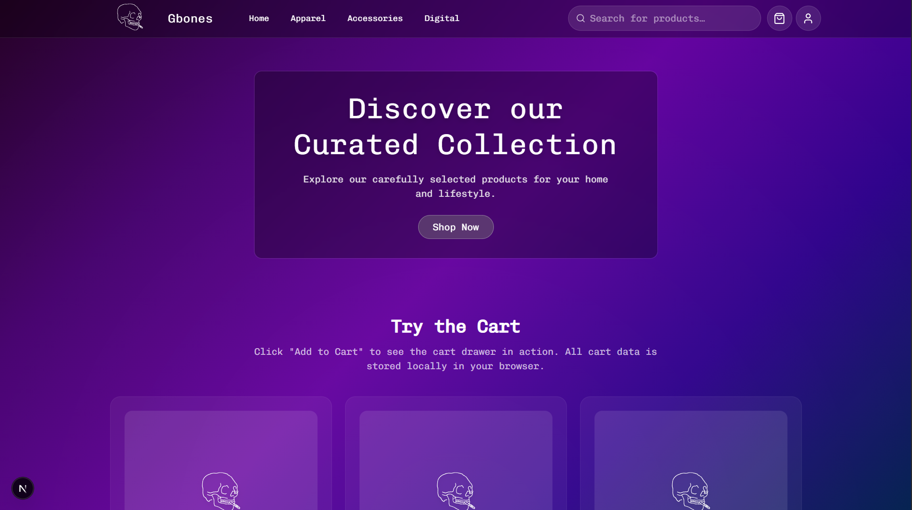
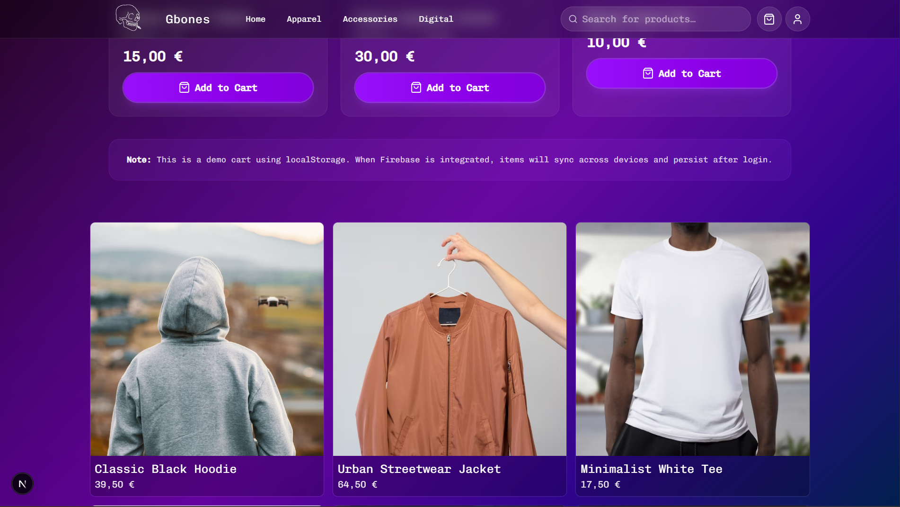

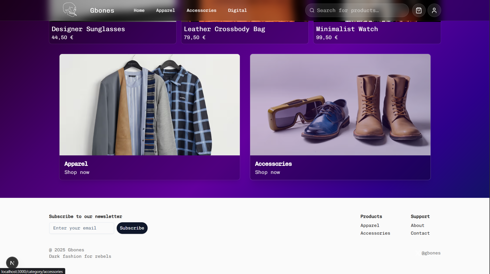

### 📱 Home (Mobile)
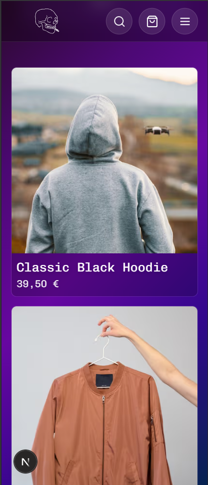

---

### 🛒 Cart
**Desktop**  
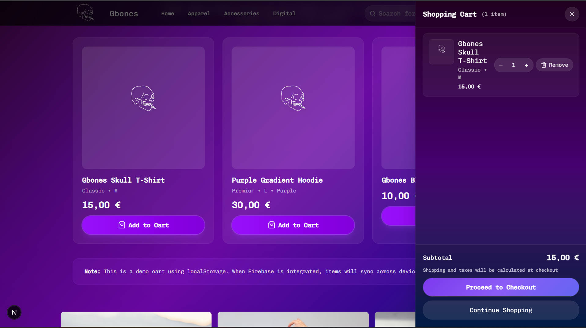

**Mobile**  
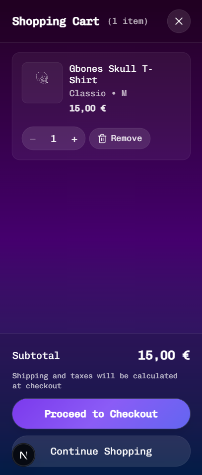

---

### 🔐 Login
**Desktop**  
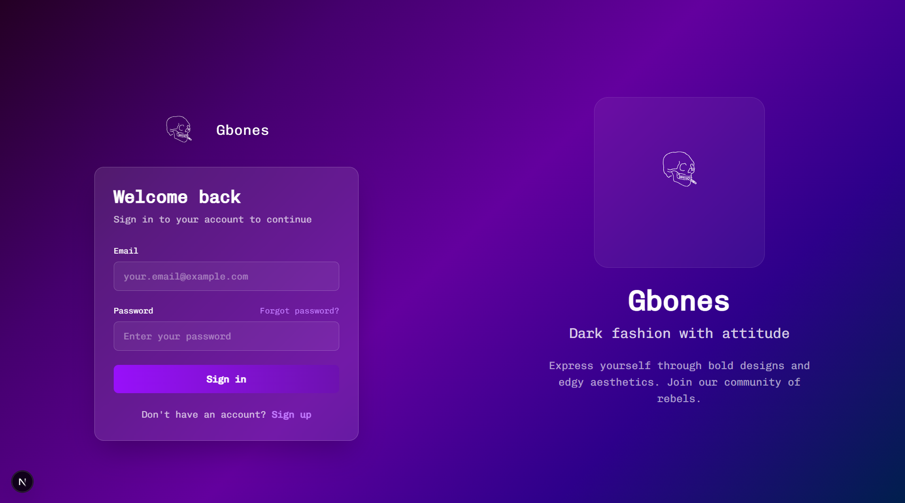

**Mobile**  
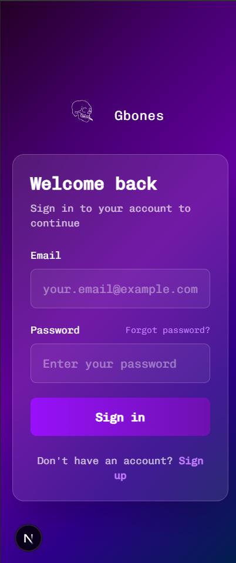

---

### 🔑 Sign In
**Desktop**  
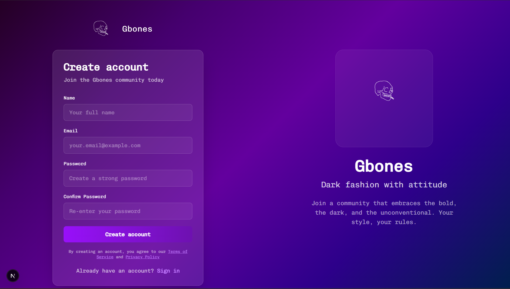

**Mobile**  
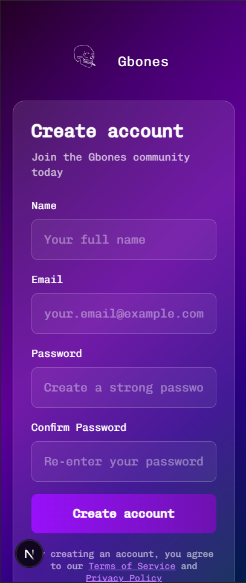

---

### 🍔 Burger Menu (Mobile)
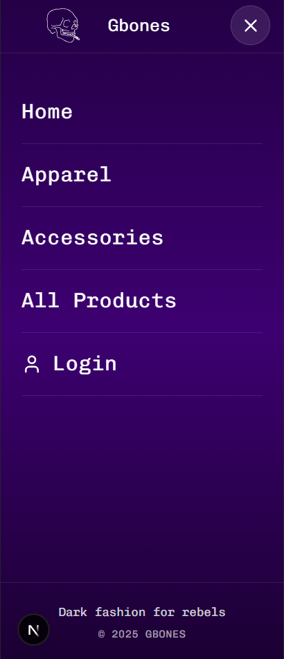

---

## 🛠️ Tech Stack
- **Next.js** 14  
- **TypeScript**  
- **Tailwind CSS**  
- **Stripe** (for payment processing)  
- **Vercel** (deployment)

---

## ⚙️ Setup

1. Clone this repository:
   ```bash
   git clone https://github.com/guillecordel/TiendaGbones.git
   cd TiendaGbones
Install dependencies:

bash
Copiar código
npm install
Create a .env.local file with your environment variables:

env
Copiar código
NEXT_PUBLIC_STRIPE_PUBLISHABLE_KEY=your_key
STRIPE_SECRET_KEY=your_key
STRIPE_CURRENCY=usd
Run the development server:

bash
Copiar código
npm run dev
💡 Features
🖤 Dark gradient aesthetic

🛍️ Product browsing and cart management

💳 Secure checkout via Stripe

📱 Responsive design for mobile and desktop

⚡ Fast performance with Next.js

📄 License
This project is licensed under the MIT License.
© 2025 Gbones. All rights reserved.